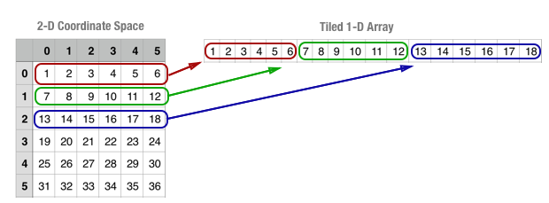
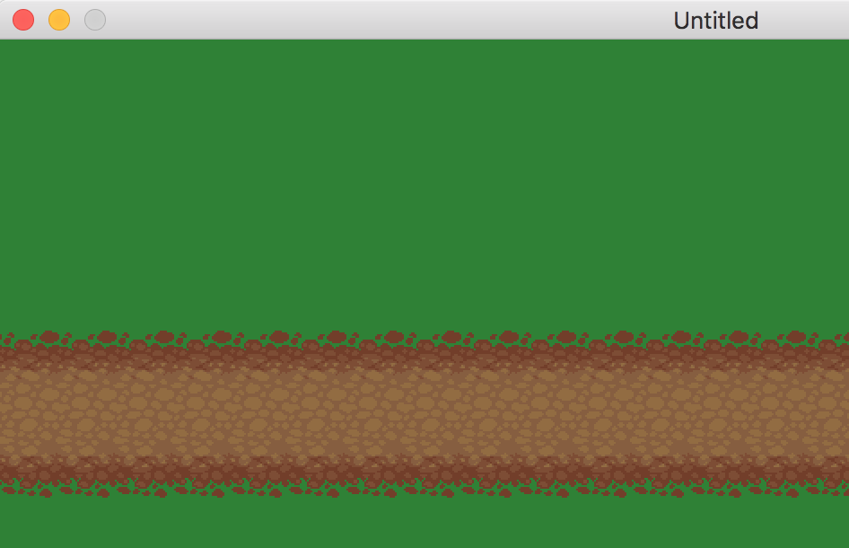
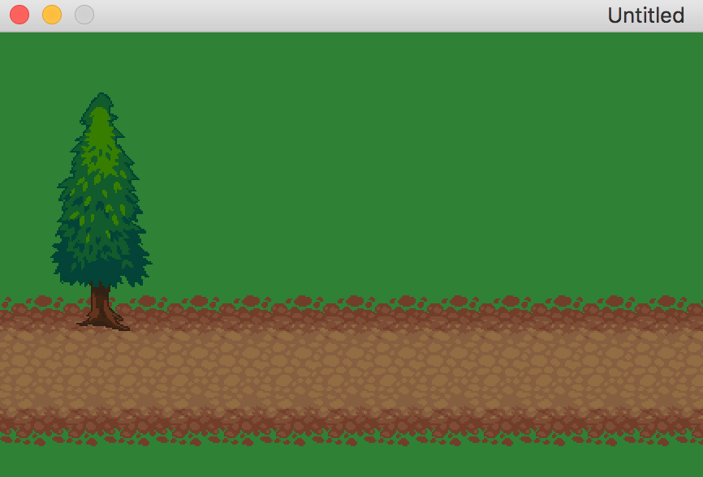

# STI Procedural Generation Example

This repository provides an example of procedurally-generating Tiled-format maps in the Lua (`.lua`) format and using this with the STI ([Simple Tiled Implementation](https://github.com/karai17/Simple-Tiled-Implementation)) library. My aim is to demystify the Tiled format and to encourage others to use STI when doing procedural generation (i.e. generating random maps for roguelike or sandbox/open world games). This code depends on the ability to pass a map table into STI directly, which was added in `v0.16.0.4`.

## Creating the map table

The first step is to create a table for your map:

```lua
-- create a new orthogonal map that is 64x64 tiles, each tile is 32x32 pixels
local map = {
  orientation = "orthogonal",
  width = 64,
  height = 64,
  tilewidth = 32,
  tileheight = 32,
  tilesets = {},
  layers = {}
}
```

I set the orientation to `orthogonal` (a typical top-down view). Notice that I create placeholders for tilesets and layers and setup the dimensions (in "tile" units -- the number of tiles across & number of tiles high) and also include pixel-dimensions of individual tiles.

## Creating a tileset

In order for a map to display graphics, we need to reference a tileset. Each tileset image is a single image, usually a PNG, with all the tile images in it:

```lua
-- create a tileset from an image (Liberated Pixel Cup terrain_atlas.png from opengameart.org)
local tileset = {
  name = "terrain_atlas",
  firstgid = 1,
  tilewidth = 32,
  tileheight = 32,
  spacing = 0,
  margin = 0,
  image = "terrain_atlas.png",
  imagewidth = 1024,
  imageheight = 1024,
  tileoffset = {x = 0, y = 0},
  tilecount = 1024,
  tiles = {}
}
table.insert(map.tilesets, tileset)
```

This is a 32x32 tileset from the (excellent) [Liberated Pixel Cup](http://lpc.opengameart.org/) on opengameart.org. The `tilecount` in my example happens to match the `imagewidth` and `imageheight`, but this isn't necessary.

Aside: in the Tiled format, I think the `spacing` and `margin` values are not completely independent of each-other. I could be wrong, but I think I recall being surprised that one includes the other.

## Creating a map layer

Tiled maps are made up of layers, which are drawn in order. For this tutorial, we'll create a few layers, so we can layer things on top of each-other:

```lua
-- create a layer of the map, with the same height/width as the map
function addLayer(map, name)
  local layer = {
    type = "tilelayer",
    name = name,
    x = 0,
    y = 0,
    width = 64,
    height = 64,
    visible = true,
    opacity = 1,
    offsetx = 0,
    offsety = 0,
    properties = {},
    encoding = "lua",
    data = {}
  }
  table.insert(map.layers, layer)
  return layer
end
local layer = addLayer(map, "grass")
```

I don't think the name is strictly necessary, but it may be helpful later on. All the data here is pretty much boilerplate & matches the map data.

## Pre-populating the layer with grass tiles

In the Tiled format a `0` represents an empty tile. The format seems to require that the entire layer be populated, so in some cases it's easiest to just pre-populate the whole layer with empty tiles or -- in our case -- with a grass tile:

```lua
-- populate the layer with a default tile ID
function populateLayer(layer, tile_id)
  for i=1, layer.width * layer.height do
    table.insert(layer.data, tile_id)
  end
end

-- helper function to get the ID of a tile from the tileset using x,y coordinates
function getTileID(tileset, x, y)
  local width = tileset.imagewidth / tileset.tilewidth
  return x + y * width + 1 -- +1 because Tile ID 0 represents an empty tile
end

-- create a grass background layer
local grass_tile_id = getTileID(tileset, 22, 3)
populateLayer(layer, grass_tile_id)
```

 The thing that makes this a little tricky is that the Tiled format "unrolls" 2-dimensional layer data onto a flat 1-dimensional array:



This one-dimensional array is compact and memory efficient, but it means that we can't reference tiles easily by their x,y coordinates. Instead, we need to calculate the index in the 1-D array with the formula `x + y * width + 1`. The `+ 1` is because Tile IDs are 1-based (the 0 Tile ID is reserved to represent an empty tile).

## Draw a path in a new layer

In the LPC tilesheet, there are path tiles from coordinates (18,2) to (20,4). We want a path that stretches horizontally across our map, so we'll just take the middle column of path tiles (19,2) to (19,4):

```lua
-- helper function to set a tile in the layer based on x,y coordinates
function setTile(layer, x, y, tile_id)
  layer.data[x + y * layer.width + 1] = tile_id -- +1 because Tile ID 0 represents an empty tile
end

-- create a layer for the path
local path_layer = addLayer(map, "path")
populateLayer(path_layer, 0)

for x=0, path_layer.width - 1 do
  setTile(path_layer, x, 5, getTileID(tileset, 19, 2))
  setTile(path_layer, x, 6, getTileID(tileset, 19, 3))
  setTile(path_layer, x, 7, getTileID(tileset, 19, 4))
end
```

Note that `setTile()` uses the same `x + y * width + 1` formula to convert from (x,y) space to Tiled's 1-dimensional array (`+ 1` because Lua arrays are 1-based).

Now, after we add in some LÖVE and STI boilerplate (you can find this in the main.lua file), and we can see our path:



## Draw a tree in a new layer

 In the LPC tilesheet, there is a tree from the top-left coordinate of (30, 0) to the bottom-right coordinate of (31, 4), assuming a coordinate system that starts at (0, 0). Here, we add each of the 8 tree tiles to the layer:

```lua
-- create a layer for objects like trees
local objects_layer = addLayer(map, "objects")
populateLayer(objects_layer, 0)
setTile(objects_layer, 1, 1, getTileID(tileset, 30, 0))
setTile(objects_layer, 2, 1, getTileID(tileset, 31, 0))
setTile(objects_layer, 1, 2, getTileID(tileset, 30, 1))
setTile(objects_layer, 2, 2, getTileID(tileset, 31, 1))
setTile(objects_layer, 1, 3, getTileID(tileset, 30, 2))
setTile(objects_layer, 2, 3, getTileID(tileset, 31, 2))
setTile(objects_layer, 1, 4, getTileID(tileset, 30, 3))
setTile(objects_layer, 2, 4, getTileID(tileset, 31, 3))
setTile(objects_layer, 1, 5, getTileID(tileset, 30, 4))
setTile(objects_layer, 2, 5, getTileID(tileset, 31, 4))
```

Here's an updated screenshot with the tree:



## Afterword

I hope the above example made the Tiled Lua format clearer and more approachable. While it is certainly possible to ignore this format and the STI library and to instead create your own table format for procedurally-generated terrain, there are advantages to using the STI library, since has become a bit of a standard in the LÖVE community and many libraries, tutorials and example code use it or interoperate well with it.
